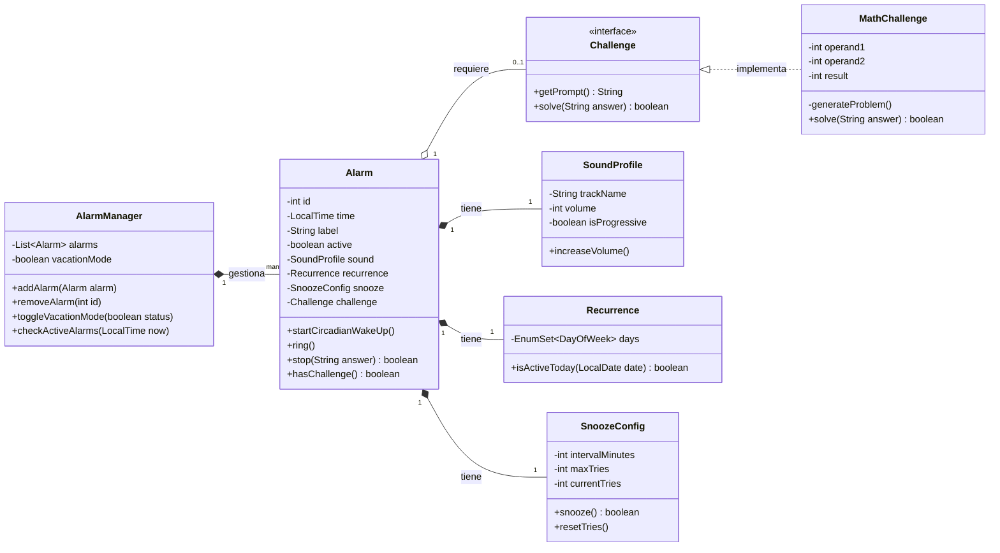
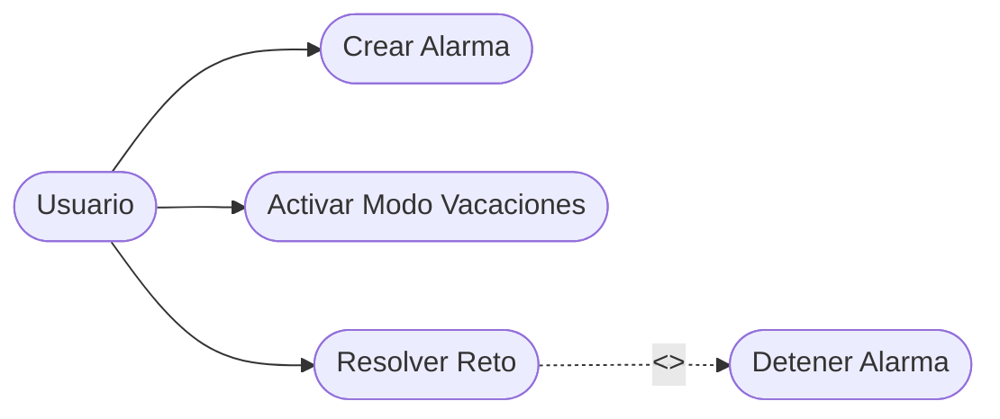

# ⏰ Smart Alarm System - Java

## 1. Descripción del proyecto

**Smart Alarm System** es un sistema de gestión de alarmas inteligente desarrollado en Java. A diferencia de un despertador convencional, este sistema integra dinámicas de **Despertar Circadiano** (progresión sensorial) y **Retos Cognitivos** (gamificación) para asegurar que el usuario no solo se despierte, sino que active su mente antes de apagar la alerta.

---

## 2. Objetivos

* Evitar el "Snooze" infinito mediante la resolución de retos matemáticos obligatorios.
* Mejorar la higiene del sueño implementando un despertar progresivo que evita el estrés del sonido repentino.
* Permitir configuraciones específicas para vacaciones y repeticiones semanales.

---

## 3. Tecnologías utilizadas

* **Lenguaje:** Java JDK 17+
* **Gestor de versiones:** Git / GitHub
* **Modelado:** Mermaid (UML)
* **Lógica de tiempo:** API `java.time`

---

## 4. Instalación y ejecución

```bash
# Clonar el repositorio
git clone https://github.com/brunofahern-source/despertador-inteligente-java.git

# Navegar a la carpeta
cd despertador-inteligente-java

# Compilar
javac src/*.java -d bin

# Ejecutar
java -cp bin Main
```

---

## 5. Estructura del proyecto

```text
/src                # Código fuente (.java)
README.md           # Guía principal del proyecto
```

---

## 6. Diseño Orientado a Objetos

### Clases y responsabilidades

* **AlarmManager:** Actúa como controlador central (Low Coupling).
* **Alarm:** Entidad que encapsula los datos y el estado de la alerta.
* **Challenge (Interfaz):** Define el contrato para la extensibilidad de retos.

### Relaciones

* **Composición:** `SoundProfile`, `Recurrence` y `SnoozeConfig`, ya que su ciclo de vida depende de la alarma.
* **Agregación:** `Challenge`, ya que es opcional.

### Encapsulación

Todos los atributos son `private` y se acceden mediante métodos `public` (getters/setters), protegiendo la lógica interna.

---

## 7. Diagrama de Clases UML



---

## 8. Diagrama de Casos de Uso



> **Nota:** GitHub no soporta completamente `usecaseDiagram` de Mermaid. Por compatibilidad es mejor utilizar `flowchart`, que sí se visualiza correctamente.

---

## 9. Especificación de Casos de Uso

### UC-01: Detener Alarma con Reto

| Campo                   | Detalle                                                                                                                                   |
| ----------------------- | ----------------------------------------------------------------------------------------------------------------------------------------- |
| **Nombre**              | UC-01: Detener Alarma con Reto                                                                                                            |
| **Objetivo**            | Asegurar que el usuario está despierto antes de silenciar el dispositivo.                                                                 |
| **Actor principal**     | Usuario                                                                                                                                   |
| **Precondiciones**      | La alarma debe estar sonando y tener un reto asignado.                                                                                    |
| **Flujo principal**     | 1. La alarma suena.<br>2. El sistema muestra el reto.<br>3. El usuario introduce la respuesta.<br>4. El sistema valida y apaga la alarma. |
| **Flujos alternativos** | 3a. Respuesta incorrecta: el sistema mantiene el sonido y solicita una nueva respuesta.                                                   |
| **Postcondiciones**     | La alarma se detiene y se marca como procesada.                                                                                           |
| **Reglas de negocio**   | No se puede apagar la alarma mediante `stop()` si la respuesta es nula o incorrecta.                                                      |

---

## 10. Reflexión Técnica

### Decisiones de diseño

Se optó por `EnumSet` para la recurrencia por su alta eficiencia en memoria y facilidad para manejar días de la semana.

### Problemas encontrados

La gestión de hilos en la simulación de tiempo del `Main` fue compleja de sincronizar con el `AlarmManager`.

### Mejoras futuras

* Implementar persistencia mediante SQLite.
* Desarrollar una interfaz gráfica (GUI) con Swing.

### Patrones aplicados

* **Strategy** para los retos.
* **Singleton** (potencialmente) para `AlarmManager`.

---

## 11. Reflexión sobre IA

### Ayuda

Gemini facilitó la generación de código repetitivo (boilerplate) y la estructura inicial de los diagramas Mermaid.

### Fallos

La IA inicialmente sugirió una estructura de carpetas que no coincidía con el entorno de VS Code, por lo que fue necesario corregir manualmente los `package`.

### Aprendizaje

He aprendido a delegar la lógica de negocio en interfaces para hacer el código más extensible y a documentar adecuadamente cada paso del proceso utilizando Git.
